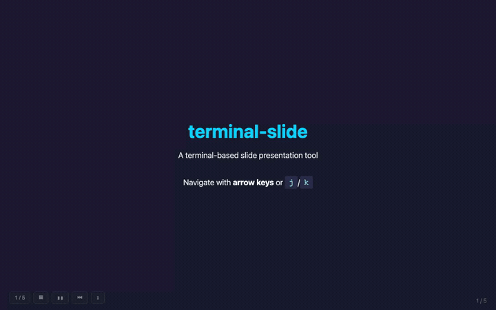
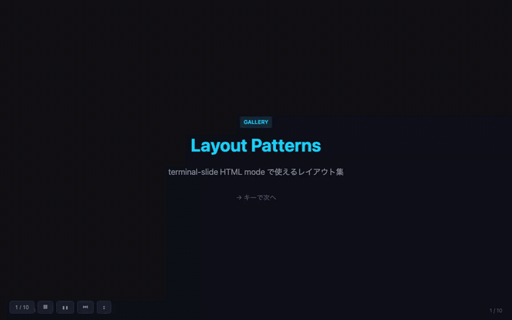
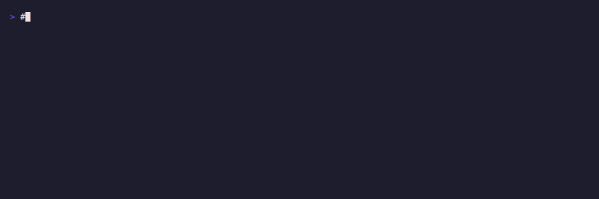
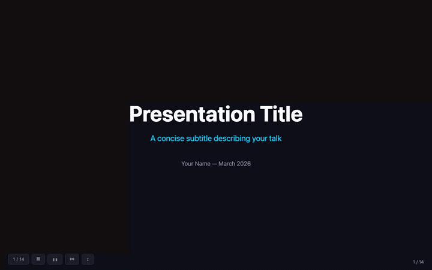
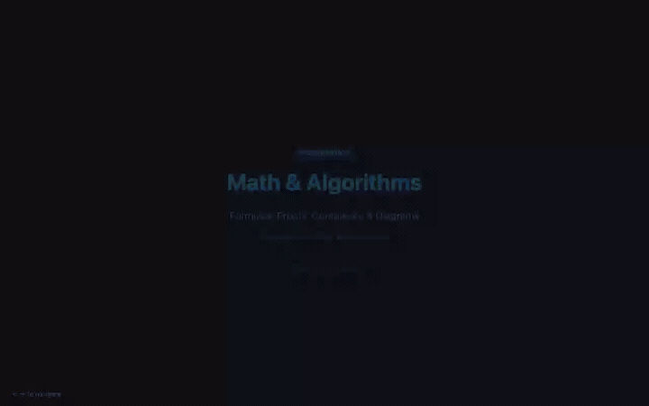
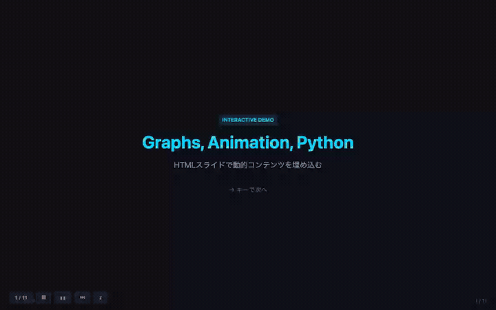
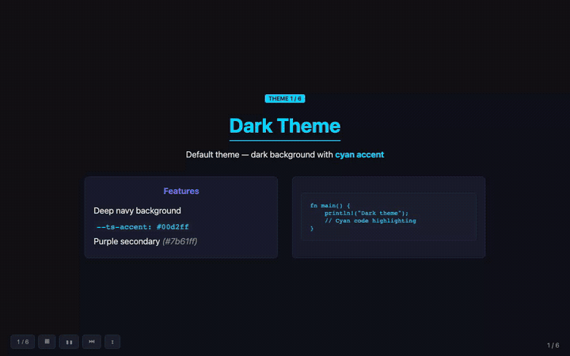

<h1 align="center">terminal-slide</h1>

<p align="center">
  <strong>Present slides from the terminal — Markdown or HTML, zero config.</strong>
</p>

<p align="center">
  <a href="LICENSE"></a>
  <a href="https://www.rust-lang.org/"></a>
  <a href="https://github.com/lutelute/terminal-slide"></a>
</p>

<p align="center">
  
</p>

---

## Features

- **Markdown → Terminal** — TUI presentation with syntax highlighting and slide transitions
- **HTML → Browser** — Serve locally with auto-injected navigation, animation controls, and export UI
- **Export** — PDF, HTML, PPTX, Markdown via CLI or browser toolbar
- **Templates** — 14 layout patterns, 6 color themes, 2 starter templates
- **Zero config** — One command, no build step, no config files

## Install

```bash
# From source
git clone https://github.com/lutelute/terminal-slide.git
cd terminal-slide
cargo install --path .
```

> Requires [Rust toolchain](https://rustup.rs/).

## Quick Start

```bash
# Markdown slides in the terminal
terminal-slide slides.md

# HTML slides in the browser
terminal-slide presentation.html
```

Write Markdown slides separated by `---`:

```markdown
# My Talk

Welcome!

---

## Agenda

- Topic 1
- Topic 2

---

## Code

```python
print("Hello, world!")
```
```

## Two Modes

### Markdown Mode (Terminal)

Best for quick talks and technical LTs. Runs entirely in the terminal with syntax highlighting, bold/italic, tables, and slide transition animations.

```bash
terminal-slide talk.md
```

### HTML Mode (Browser)

Best for rich presentations with charts, math, diagrams, and interactive content. Starts a local server and opens the browser with auto-injected navigation.

```bash
terminal-slide presentation.html
```

<p align="center">
  
</p>

| Button | Function |
|--------|----------|
| `1 / N` | Slide jump — click to open numbered grid |
| `▦` | Gallery — full-screen thumbnail view |
| `⏸` | Pause CSS animations |
| `⏭` | Skip all animations |
| `⇓` | Export (PDF, HTML, Markdown) |

HTML mode supports any JS library via CDN: [Chart.js](https://www.chartjs.org/), [KaTeX](https://katex.org/), [Mermaid](https://mermaid.js.org/), [Pyodide](https://pyodide.org/), D3, Three.js, etc.

### Gallery View

Click `▦` to see all slides as thumbnails. Jump to any slide instantly.

<p align="center">
  
</p>

## Export

<p align="center">
  
</p>

```bash
terminal-slide talk.md --export pdf             # MD → PDF (pandoc + beamer)
terminal-slide talk.md --export html            # MD → HTML (self-contained)
terminal-slide talk.md --export pptx            # MD → PPTX
terminal-slide slides.html --export pdf         # HTML → PDF (headless Chrome)
terminal-slide slides.html --export md          # HTML → Markdown
terminal-slide talk.md --export pdf -o out.pdf  # Custom output path
```

Also available from the browser toolbar (⇓ button) in HTML mode.

<details>
<summary>External tool requirements</summary>

| Conversion | Requires |
|------------|----------|
| MD → PDF | [pandoc](https://pandoc.org/) + LaTeX (`brew install pandoc basictex`) |
| MD → PPTX | [pandoc](https://pandoc.org/) |
| MD → HTML | None (built-in) |
| HTML → PDF | Chrome or Chromium (auto-detected, or set `CHROME_PATH`) |
| HTML → MD/PPTX | [pandoc](https://pandoc.org/) |

</details>

## Keyboard Shortcuts

Works in both modes.

| Action | Keys |
|--------|------|
| Next slide | `→` `l` `j` `n` `Space` |
| Previous slide | `←` `h` `k` `p` |
| First slide | `g` |
| Last slide | `G` |
| Quit | `q` `Esc` `Ctrl+C` |

## Templates

Ready-to-use templates in `templates/`:

```bash
cp templates/starter.html my-talk.html   # Dark theme starter
terminal-slide my-talk.html
```

### Layout Patterns

14 copy-paste layout patterns: Title, Two Column, Three Column, Code Showcase, Timeline, Stats Grid, Comparison, Quote, and more.

<p align="center">
  
</p>

### Math & Algorithms

KaTeX formulas, algorithm pseudocode, Big-O comparison, Mermaid flowcharts.

<p align="center">
  
</p>

### Code & Syntax Highlighting

Multi-language code blocks, diff views, terminal-style output.

<p align="center">
  
</p>

### Interactive & Charts

Chart.js graphs, CSS animations, live Python (Pyodide), Canvas particle effects.

<p align="center">
  
</p>

## Themes

6 CSS themes with swappable custom properties:

<p align="center">
  
</p>

| Theme | Style |
|-------|-------|
| `dark.css` | Dark background, cyan accent (default) |
| `light.css` | White background, blue accent |
| `corporate.css` | Navy, professional |
| `neon.css` | Black, green + magenta glow |
| `paper.css` | Warm sepia, serif typography |
| `minimal.css` | Black and white |

> Preview: `terminal-slide templates/layouts.html` / [Live gallery](https://lutelute.github.io/terminal-slide/)

## Examples

```bash
terminal-slide examples/demo.md           # Basic TUI demo
terminal-slide examples/demo.html         # Browser demo
terminal-slide examples/gallery.html      # Layout gallery (14 patterns)
terminal-slide examples/interactive.html  # Charts, animations, Python
terminal-slide examples/math-algo.html    # KaTeX + Mermaid diagrams
```

## CLI Reference

```
terminal-slide [OPTIONS] <FILE>
```

| Option | Description | Default |
|--------|-------------|---------|
| `<FILE>` | Path to `.md` or `.html` file | (required) |
| `--port <PORT>` | HTTP server port (HTML mode) | `8234` |
| `--export <FMT>` | Export: `pdf`, `pptx`, `md`, `html` | — |
| `-o, --output <PATH>` | Output file path | auto |
| `-h, --help` | Print help | — |
| `-V, --version` | Print version | — |

## Markdown vs HTML

| | Markdown (`.md`) | HTML (`.html`) |
|---|---|---|
| Display | Terminal (TUI) | Browser |
| Layout | Single column | Fully customizable (CSS) |
| Code highlighting | Yes | Yes |
| Charts / Math / Diagrams | — | Chart.js, KaTeX, Mermaid |
| Animations | Slide transitions | CSS/JS + pause/skip |
| Interactive | — | JS, Pyodide, etc. |
| Speed to create | Fast | Moderate |
| Best for | Quick/internal talks | Rich/external presentations |

## Known Issues

- Slide content may overflow horizontally on smaller viewports ([#2](https://github.com/lutelute/terminal-slide/issues/2))

## Contributing

Contributions are welcome! Feel free to open issues and pull requests.

1. Fork the repository
2. Create your feature branch (`git checkout -b feature/amazing-feature`)
3. Commit your changes (`git commit -m 'Add amazing feature'`)
4. Push to the branch (`git push origin feature/amazing-feature`)
5. Open a Pull Request

## Built With

- [ratatui](https://github.com/ratatui/ratatui) — Terminal UI framework
- [tachyonfx](https://github.com/junkdog/tachyonfx) — Terminal effects and animations
- [pulldown-cmark](https://github.com/raphlinus/pulldown-cmark) — Markdown parser
- [syntect](https://github.com/trishume/syntect) — Syntax highlighting
- [tiny_http](https://github.com/tiny-http/tiny-http) — Lightweight HTTP server
- [clap](https://github.com/clap-rs/clap) — CLI argument parsing

## License

[MIT](LICENSE)

---

<p align="center">
  <sub>Terminal GIFs recorded with <a href="https://github.com/charmbracelet/vhs">VHS</a> / Browser GIFs recorded with <a href="https://playwright.dev/">Playwright</a> + <a href="https://ffmpeg.org/">FFmpeg</a></sub>
</p>
